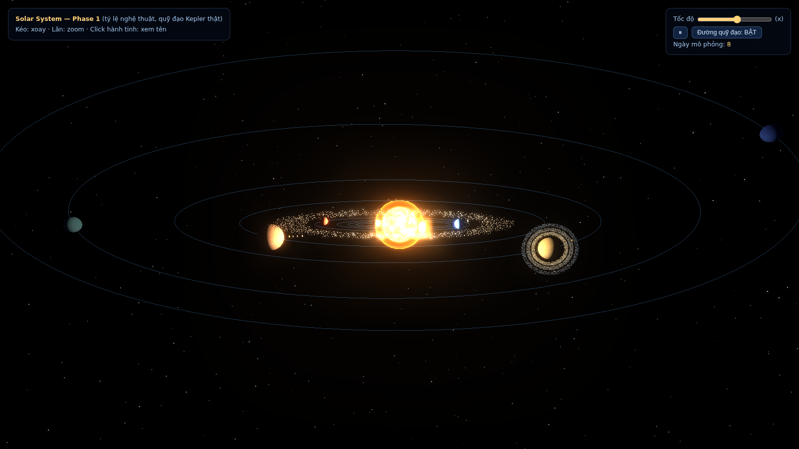
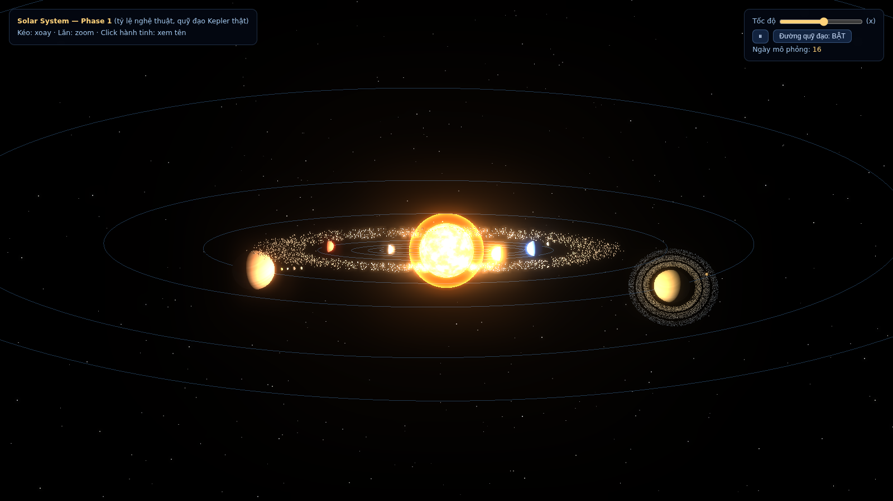
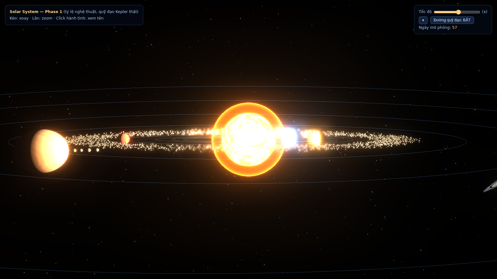

# COSMOS — Hệ Mặt Trời 3D Self-Hosted



*Hệ mặt trời đầy đủ: 8 hành tinh quỹ đạo Kepler, asteroid belt, vành Sao Thổ particle*

| | |
|---|---|
|  |  |
| *Hệ trong + asteroid belt* | *Mặt Trời shader FBM + moons Galilean* |

Hệ mặt trời Three.js với quỹ đạo Kepler nghiêm ngặt, chạy trong Docker, sẵn sàng gắn tên miền + HTTPS.

## Cấu trúc

```
cosmos-app/
├── docker-compose.yml      # service chính + block sẵn proxy/certbot (commented)
├── Dockerfile              # nginx + COPY conf/site vào image (bất biến, version được)
├── nginxconf/default.conf  # gzip, cache 7d, security headers
└── public/
    ├── index.html          # Solar System 3D (Phase 1-3 hoàn chỉnh)
    └── vendor/three/       # Three.js 0.160.0 self-hosted → app chạy OFFLINE 100%
```

## Chạy

```bash
cd cosmos-app
docker compose up -d --build     # build + chạy ở cổng 8090
docker compose ps                # kiểm tra: phải thấy (healthy)
docker compose logs -f           # xem log
```

Truy cập: `http://IP-SERVER:8090`

## Gắn tên miền + HTTPS (Let's Encrypt)

### 1. Trỏ DNS
Tại nhà cung cấp tên miền, tạo bản ghi:
```
Type: A    Name: cosmos (hoặc @)    Value: <IP public server>    TTL: 300
```
Kiểm tra: `dig +short cosmos.tenmiencuaban.com` → phải ra đúng IP.

### 2. Bật proxy + certbot
Mở `docker-compose.yml`, uncomment block `cosmos-proxy` và `certbot`, đồng thời:
- Sửa `ports` của service `cosmos` từ `"8090:80"` thành `"8090:80"` (giữ) — proxy sẽ chiếm 80/443
- Tạo `nginxconf/proxy.conf`:

```nginx
server {
    listen 80;
    server_name cosmos.tenmiencuaban.com;
    location /.well-known/acme-challenge/ { root /var/www/certbot; }
    location / { return 301 https://$host$request_uri; }
}
server {
    listen 443 ssl http2;
    server_name cosmos.tenmiencuaban.com;

    ssl_certificate     /etc/letsencrypt/live/cosmos.tenmiencuaban.com/fullchain.pem;
    ssl_certificate_key /etc/letsencrypt/live/cosmos.tenmiencuaban.com/privkey.pem;

    location / {
        proxy_pass http://cosmos:80;
        proxy_set_header Host $host;
        proxy_set_header X-Real-IP $remote_addr;
        proxy_set_header X-Forwarded-For $proxy_add_x_forwarded_for;
        proxy_set_header X-Forwarded-Proto $scheme;
    }
}
```

### 3. Cấp chứng chỉ lần đầu
```bash
docker compose up -d cosmos-proxy
docker compose run --rm certbot certonly --webroot -w /var/www/certbot \
  -d cosmos.tenmiencuaban.com --email email@ban.com --agree-tos --no-eff-email
docker compose restart cosmos-proxy
```

### 4. Kiểm tra
```bash
curl -I https://cosmos.tenmiencuaban.com   # HTTP/2 200
docker compose run --rm certbot renew --dry-run   # test gia hạn
```

## Bảo trì

| Việc | Lệnh |
|---|---|
| Cập nhật app (sửa index.html) | `docker compose up -d --build` |
| Backup | `tar czf cosmos-backup.tar.gz cosmos-app/` |
| Xem tài nguyên | `docker stats cosmos-web` |
| Cập nhật Three.js | Tải tgz mới từ registry.npmjs.org, thay `public/vendor/three/` |

## Ghi chú kỹ thuật

- **Tỷ lệ nghệ thuật**: khoảng cách nén theo `d = 11·a^0.55` — không phải tỷ lệ thật (đã ghi trong code)
- **Quỹ đạo Kepler**: giải `M = E − e·sin E` bằng Newton-Raphson — dữ liệu NASA fact sheet
- **Performance**: 60 FPS trên máy phổ thông; asteroid belt dùng InstancedMesh (1 draw call)
- **Security**: security headers đã bật trong nginx conf; chỉ mở cổng 80/443/8090 cần thiết
